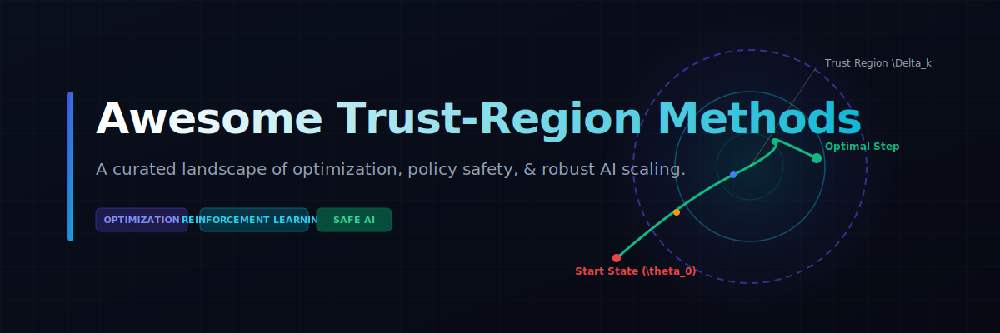
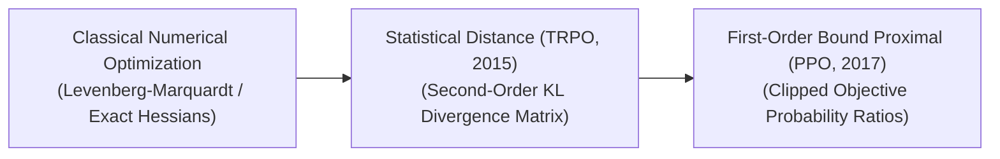

<!--
SEO Metadata:
Description: A curated repository of Trust-Region optimization methods, variants, architectures, and applications in Artificial Intelligence, Deep Learning, and Reinforcement Learning (TRPO, PPO, K-FAC).
Keywords: trust region methods, reinforcement learning, policy optimization, TRPO, PPO, K-FAC, neural networks, optimization, machine learning
-->

  

# 🚀 Awesome Trust-Region Methods

## 🎯 Trust-Region Methods in AI: Evolution, Variants, Types, & Applications

  
  
  
  
  

Trust-Region methods are a robust family of mathematical optimization frameworks used to stabilize neural network training and reinforce policy convergence in reinforcement learning (RL). Unlike traditional line-search methods (such as standard Stochastic Gradient Descent or Adam) that compute a direction vector and dynamically scale the step size, Trust-Region methods define a localized geometric boundary (the "trust region") around the current parameter state. The algorithm constructs a highly accurate quadratic or statistical model approximation *strictly within this neighborhood* and takes the optimal step inside it. By continuously expanding or shrinking the boundary based on how well the approximation matches real-world loss transitions, Trust-Region methods prevent catastrophic policy collapse, bypass sharp non-convex valleys, and guarantee numerical stability.

---

## 📅 1. The Chronological Evolution

The implementation of trust-region boundaries has transitioned from classical non-linear optimization to probability distribution constraints, moving toward scalable first-order structural approximations.

| Era / Method | Concept | Limitation / Significance | First Used (Year) | First Used Paper |
| :--- | :--- | :--- | :--- | :--- |
| [**The Classical Numerical Optimization Era (Pre-Deep Learning)**](details/classical_numerical_optimization.md) | Rooted in traditional numerical analysis via the **Levenberg-Marquardt** and Powell’s Dogleg algorithms. These methods solved non-linear least-squares problems by dynamically switching between gradient descent (when far from a solution) and Newton's method (when close). | Required computing or approximating the explicit Hessian matrix ($O(N^2)$ parameters), making it completely unscalable for deep neural networks containing millions or billions of parameters. | 1944 | [Levenberg (1944)](https://doi.org/10.1090/qam/10666) |
| [**The Statistical Distance Revolution (TRPO)**](details/statistical_distance_trpo.md) | Adapted trust regions for Deep Reinforcement Learning via **Trust Region Policy Optimization (TRPO)**. Instead of placing the geometric boundary on raw model weights, it placed the constraint on the *output probability distribution* of the policy network using **Kullback-Leibler (KL) Divergence**. | Computationally heavy. TRPO required calculating a second-order Fisher Information Matrix and running conjugate gradient inversions at every single step, slowing down execution loops. | 2015 | [Schulman et al. (2015)](https://arxiv.org/abs/1502.05477) |
| [**The First-Order Clipped Bound Era (PPO)**](details/first_order_clipped_ppo.md) | The current modern state-of-the-art framework. **Proximal Policy Optimization (PPO)** refactored the complex mathematical trust-region constraint into a simple, first-order **Clipped Objective Function**. It penalizes the optimizer if the new policy deviates outside a hard probability ratio window (typically $[1-\epsilon, 1+\epsilon]$, where $\epsilon=0.2$). | Fully preserved the execution stability and data-efficiency metrics of traditional trust regions while running at the lightning-fast speed of standard first-order gradient descent. | 2017 | [Schulman et al. (2017)](https://arxiv.org/abs/1707.06347) |

---

## ⚙️ 2. Core Functional & Algorithmic Variants

Trust-Region frameworks in artificial intelligence are strictly categorized based on the mathematical space and matrix order used to enforce the boundary constraints.

| Variant | Mechanism | Pros / Details | First Used (Year) | First Used Paper |
| :--- | :--- | :--- | :--- | :--- |
| [**Weight-Space Trust Regions**](details/weight_space_trust_regions.md) | Restricts changes to the raw physical weights ($\theta$) of the neural network: $\|\theta_{new} - \theta_{old}\|_2 \le \Delta$. | Computationally straightforward, but highly fragile in deep learning because a tiny change in a single weight can cause an erratic, explosive transformation in the network's final output behavior. | 1970 | [Powell (1970)](https://doi.org/10.1016/B978-0-12-588050-3.50010-3) |
| [**Distribution-Space Trust Regions (TRPO Baseline)**](details/distribution_space_trust_regions.md) | Bypasses raw weight constraints, focusing on behavioral output distributions: $D_{KL}(\pi_{\theta_{old}} \| \pi_{\theta_{new}}) \le \delta$. | Guarantees **monotonic policy improvement**. The model is mathematically prevented from taking a disastrous step that corrupts its learned capabilities, making it the bedrock framework for continuous robotic locomotion. | 2015 | [Schulman et al. (2015)](https://arxiv.org/abs/1502.05477) |
| [**K-FAC / Kronecker-Factored Approximate Curvature Trust Regions**](details/k_fac_curvature.md) | An advanced second-order variant. It uses a Kronecker-factored abstraction to approximate the inverse of the Fisher Information Matrix over deep neural network layers. | Captures true second-order natural gradient steps without encountering the catastrophic $O(N^3)$ computational inversion bottleneck typical of raw Hessians. | 2015 | [Martens & Grosse (2015)](https://arxiv.org/abs/1503.05671) |

---

## 🔄 3. Structural Objective Processing Types

Depending on how the boundary constraints are encoded into the loss layer, trust-region operations track execution metrics via distinct algorithmic pipelines.

| Processing Type | Pipeline | First Used (Year) | First Used Paper |
| :--- | :--- | :--- | :--- |
| [**Explicit Constrained Optimization (Hard Boundaries)**](details/explicit_constrained_optimization.md) | Models optimization as a strict dual-variable Lagrange problem. If a parameter step tries to jump past the defined KL threshold, a quadratic sub-problem solver scales back the step vector, forcing it back inside the feasible geometric circle. | 2015 | [Schulman et al. (2015)](https://arxiv.org/abs/1502.05477) |
| [**Adaptive Penalty Tracking**](details/adaptive_penalty_tracking.md) | Converts the hard boundary into a dynamic regularization penalty added to the loss function. The algorithm automatically scales the penalty multiplier up if the KL divergence drifts too high, or shrinks it if the policy remains overly conservative. | 2017 | [Schulman et al. (2017)](https://arxiv.org/abs/1707.06347) |
| [**Clipped Probability Ratio Tracking (PPO Paradigm)**](details/clipped_probability_ratio.md) | Tracks the probability ratio between the new and old policy ($r_t(\theta)$). The loss function applies a `clamp` or `clip` operator, entirely removing any mathematical gradient incentive for the model to push $r_t(\theta)$ outside a narrow, trusted structural band. | 2017 | [Schulman et al. (2017)](https://arxiv.org/abs/1707.06347) |

---

## 🛠️ 4. Production Engineering Challenges & Hardware Solutions

While Trust-Region methods offer exceptional algorithmic safety profiles, executing them across high-throughput distributed infrastructure introduces unique engineering constraints.

| Engineering Challenge | The Problem | Mitigation | First Used (Year) | First Used Paper |
| :--- | :--- | :--- | :--- | :--- |
| [**The Fisher Information Matrix Memory Bottleneck**](details/fisher_matrix_bottleneck.md) | Standard second-order TRPO requires constructing an $N \times N$ tracking matrix of policy gradients. For modern transformer or convolutional models, allocating this matrix in VRAM causes immediate infrastructure crashes and Out-Of-Memory errors. | Transition entirely to **First-Order Approximations (PPO)** or utilizing **Hessian-free vector products** via automatic differentiation, computing the mathematical trajectory without ever instantiating the massive global matrix. | 2010 | [Martens (2010)](https://dl.acm.org/doi/10.5555/3104322.3104416) |
| [**The Sample Complexity / Latency Trade-Off**](details/sample_complexity_latency.md) | Hard trust-region constraints require extensive on-policy data collection batches to calculate accurate step gradients, resulting in high latency on physical edge setups or robotic joints. | Running training inside high-throughput distributed simulators (such as NVIDIA Isaac Gym), gathering millions of environment steps in parallel across parallel tensor cores to stabilize the trust-region estimates rapidly. | 2021 | [Makoviychuk et al. (2021)](https://arxiv.org/abs/2110.10107) |

---

## 🌍 5. Frontier Real-World AI Applications

| Domain / Field | Application | First Used (Year) | First Used Paper |
| :--- | :--- | :--- | :--- |
| [**RLHF Alignment for Frontier Reasoning Models**](details/rlhf_alignment_llms.md) | Acts as the optimization backbone for aligning Large Language Models (such as OpenAI's o1/o3 or DeepSeek-R1) during the reinforcement learning phase. Trust-region clipped objectives (PPO) prevent the model from **reward-hacking**—cheating the evaluation metrics or drifting into chaotic, unparseable text patterns. | 2022 | [Ouyang et al. (2022)](https://arxiv.org/abs/2203.02155) |
| [**Autonomous Robotic Locomotion & Control Stacks**](details/autonomous_robotic_locomotion.md) | Coordinates complex kinetic movements for bipedal humanoids or quadrupedal robotic fleets. Trust-region constraints guarantee that the motor actuation network updates its joint torque policies stably, preventing erratic spikes that could cause physical hardware damage. | 2019 | [Hwangbo et al. (2019)](https://www.science.org/doi/10.1126/scirobotics.aau5872) |
| [**Deep Portfolio Optimization & High-Frequency Trading Agents**](details/deep_portfolio_optimization.md) | Drives financial asset allocation networks inside volatile trading environments. By enforcing statistical distribution trust regions over asset weights, the autonomous trading agent maps risk parameters safely, preventing sudden catastrophic market-exposure collapses during rapid macro-economic shifts. | 2017 | [Jiang et al. (2017)](https://arxiv.org/abs/1706.10059) |

