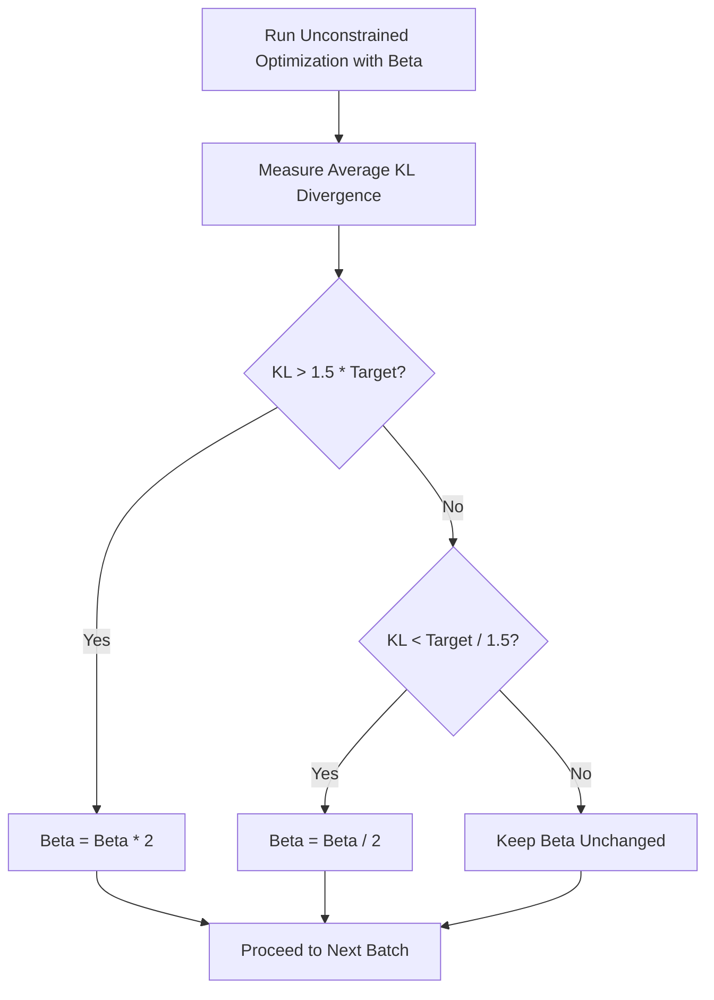

# Adaptive Penalty Tracking

Instead of solving a hard constrained optimization problem, adaptive penalty tracking converts the constraint into a soft penalty in the objective function. The penalty coefficient is updated dynamically based on whether the constraint is being violated or underutilized.

## Mathematical Formulation

The objective function is modified as:
$$L^{KLPEN}(\theta) = \hat{\mathbb{E}}_t \left[ \frac{\pi_\theta(a_t|s_t)}{\pi_{\theta_{old}}(a_t|s_t)} \hat{A}_t \right] - \beta D_{KL}(\pi_{\theta_{old}} \parallel \pi_\theta)$$

The penalty coefficient $\beta$ is updated at the end of each iteration:
* If $D_{KL} > 1.5 \cdot d_{target}$, we increase the penalty: $\beta \leftarrow 2 \beta$.
* If $D_{KL} < d_{target} / 1.5$, we decrease the penalty: $\beta \leftarrow \beta / 2$.

This allows the optimization to run using unconstrained first-order solvers while still enforcing the boundary over long training trajectories.

## Feedback Loop

[Back to README](../README.md)
