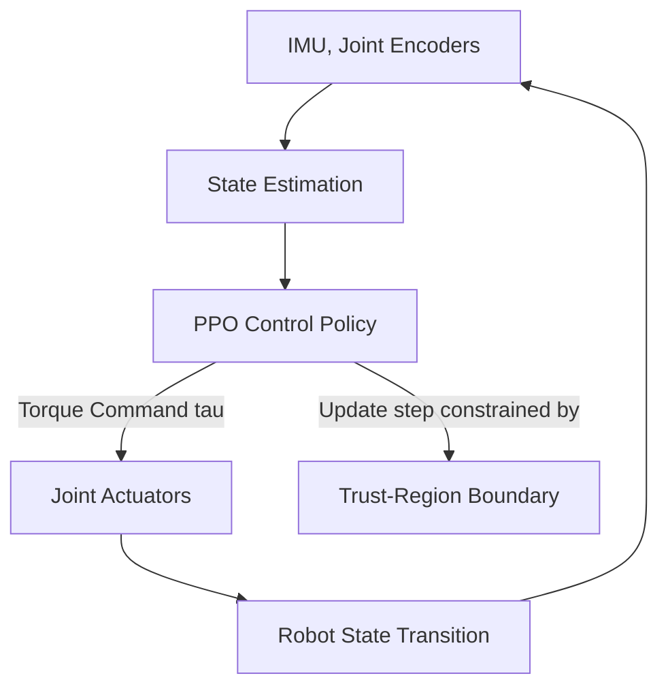

# Autonomous Robotic Locomotion & Control Stacks

In quadruped and humanoid robotics, trust-region constraints are essential to ensure the safety and physical stability of the robot during learning. Large policy updates can output unstable torque commands, causing violent movements that damage the mechanical hardware.

## Safety Constraints

The control stack maps sensor observations (joint positions, IMU readings) to joint torque targets:
$$\tau_t = \pi_\theta(s_t)$$

Applying trust-region constraints (TRPO/PPO) ensures that the joint velocities and torques change smoothly between policy updates:
$$D_{KL}(\pi_{\theta_{old}}(\cdot|s) \parallel \pi_\theta(\cdot|s)) \le \delta$$

This mathematical guarantee prevents joint velocity spikes, ensuring smooth transitions and stable dynamic balance.

## Control Stack Architecture

[Back to README](../README.md)
