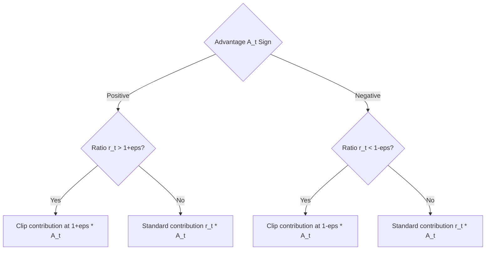

# Clipped Probability Ratio Tracking

Clipped probability ratio tracking is the primary mechanism of PPO-Clip. It directly bounds the objective function rather than the parameters or distributions, eliminating incentives for the policy to move outside the trusted ratio window.

## Mathematical Formulation

The surrogate loss restricts the probability ratio $r_t(\theta)$ using the `clip` operator:
$$L^{CLIP}(\theta) = \min\left( r_t(\theta) A_t, \text{clip}(r_t(\theta), 1-\epsilon, 1+\epsilon) A_t \right)$$

* **Positive Advantage ($A_t > 0$):** The action yielded a better-than-expected reward. We want to increase its probability, but clipping prevents the ratio from going above $1+\epsilon$, removing any gradient incentive to push the update further.
* **Negative Advantage ($A_t < 0$):** The action yielded a worse-than-expected reward. We want to decrease its probability, but clipping prevents the ratio from going below $1-\epsilon$.

## Decision Logic

[Back to README](../README.md)
