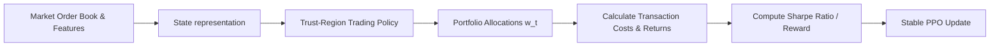

# Deep Portfolio Optimization & High-Frequency Trading

Deep reinforcement learning agents are applied to financial portfolio management and high-frequency trading. Trust-region optimization ensures that the agent's asset allocations do not shift erratically, which would lead to high transaction costs and catastrophic risk exposure.

## Financial Formulation

An agent outputs a portfolio allocation vector $w_t \in \mathbb{R}^d$ representing the proportion of capital allocated to each asset.
* **Transaction Cost:** Shifting from $w_{t-1}$ to $w_t$ incurs transaction fees proportional to $\|w_t - w_{t-1}\|_1$.
* **Risk Control:** Large updates during high market volatility can expose the portfolio to sudden losses.

Trust regions restrict policy transitions, ensuring that the model updates its allocation parameters smoothly:
$$D_{KL}(\pi_{\theta_{old}} \parallel \pi_\theta) \le \delta$$

This stabilizes the trading strategy against market noise and reduces transaction cost churn.

## Trading Agent Workflow

[Back to README](../README.md)
