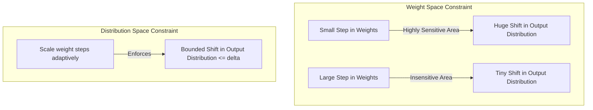

# Distribution-Space Trust Regions

Distribution-space trust regions define boundaries in the probability distribution space of the model outputs rather than the weight space. This guarantees that the step size corresponds directly to changes in model behavior, preventing policy collapse in reinforcement learning.

## Mathematical Formulation

Instead of a parameter norm constraint, we constrain the expected KL divergence:
$$\mathbb{E}_{s} \left[ D_{KL}(\pi_{\theta}(\cdot|s) \parallel \pi_{\theta + \Delta \theta}(\cdot|s)) \right] \le \delta$$

This ensures that the update steps are scaled based on their actual behavioral impact. For example, if a weight change of 0.01 changes the output distribution by a KL of 5.0, the step is scaled down. If it changes the distribution by 0.0001, the step is allowed to be larger.

## Contrast: Weight Space vs. Distribution Space

[Back to README](../README.md)
