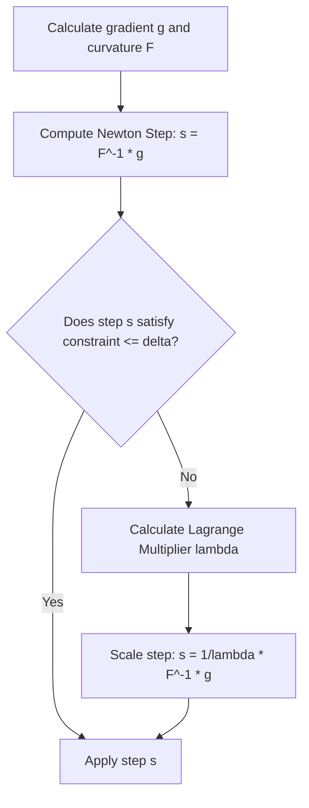

# Explicit Constrained Optimization (Hard Boundaries)

Explicit constrained optimization treats the trust region boundary as a hard constraint. If a proposed optimization step violates the boundary, the step is dynamically projected back onto the constraint surface using Lagrange duality.

## Mathematical Formulation

We solve:
$$\max_{\theta} g^T \Delta \theta \quad \text{s.t.} \quad \frac{1}{2} \Delta \theta^T F \Delta \theta \le \delta$$

The Lagrangian is:
$$\mathcal{L}(\Delta \theta, \lambda) = g^T \Delta \theta - \lambda \left( \frac{1}{2} \Delta \theta^T F \Delta \theta - \delta \right)$$

Taking the derivative with respect to $\Delta \theta$ and setting to 0 gives:
$$\Delta \theta = \frac{1}{\lambda} F^{-1} g$$

Substituting back into the constraint allows us to solve for the Lagrange multiplier $\lambda$:
$$\lambda = \sqrt{\frac{g^T F^{-1} g}{2 \delta}}$$

## Solver Logic

[Back to README](../README.md)
