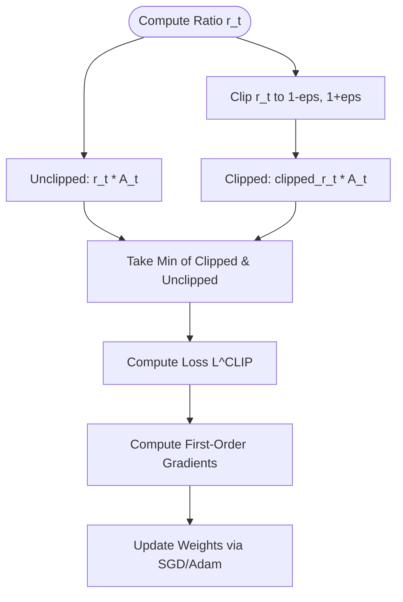

# The First-Order Clipped Bound Era (PPO)

Proximal Policy Optimization (PPO) simplifies the complex second-order machinery of TRPO into a first-order optimization method. By using a clipped surrogate objective, it penalizes policy updates that move the probability ratio too far from 1, effectively keeping the update within a trust region without calculating the Fisher Information Matrix.

## Mathematical Formulation

The PPO clipped objective is defined as:
$$L^{CLIP}(\theta) = \hat{\mathbb{E}}_t \left[ \min(r_t(\theta)\hat{A}_t, \text{clip}(r_t(\theta), 1-\epsilon, 1+\epsilon)\hat{A}_t) \right]$$

Where:
* $r_t(\theta) = \frac{\pi_\theta(a_t|s_t)}{\pi_{\theta_{old}}(a_t|s_t)}$ is the probability ratio.
* $\hat{A}_t$ is the estimated advantage at time step $t$.
* $\epsilon$ is a hyperparameter (typically 0.1 or 0.2).

Taking the minimum of the clipped and unclipped objectives prevents the policy from making excessively large steps that would otherwise result in a very high objective value, creating a pessimistic bound.

## Algorithmic Workflow

[Back to README](../README.md)
