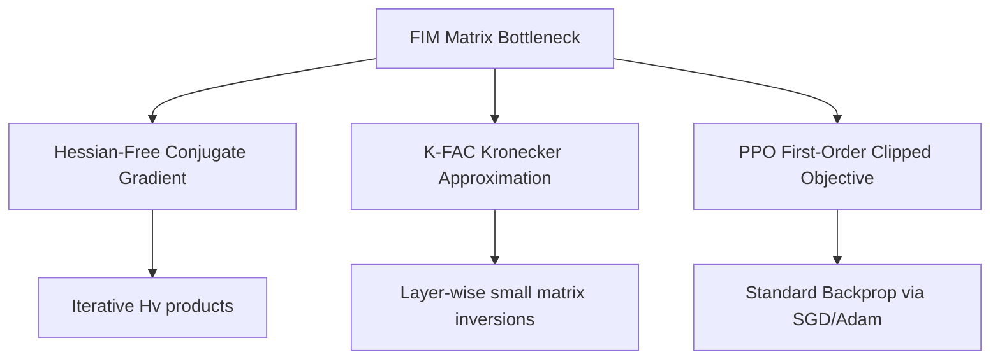

# The Fisher Information Matrix Memory Bottleneck

Standard second-order trust region methods require computing and inverting the Fisher Information Matrix (FIM). For a network with $N$ parameters, the FIM has size $N \times N$, making storage ($O(N^2)$) and inversion ($O(N^3)$) highly unscalable.

## Complexity Scaling

| Metric | Raw FIM | K-FAC Approximation | First-Order (PPO) |
| :--- | :--- | :--- | :--- |
| **Storage Complexity** | $O(N^2)$ | $O(\sum d_l^2)$ | $O(N)$ |
| **Inversion Complexity** | $O(N^3)$ | $O(\sum d_l^3)$ | None ($O(1)$) |
| **Scaling for 1M parameters** | 4 TB storage (Failed) | ~Few MBs (Feasible) | Negligible |

## Mitigations
1. **Conjugate Gradient (Hessian-free):** Computes $H^{-1}g$ iteratively by only computing matrix-vector products $H v$, avoiding explicit matrix construction.
2. **Kronecker Factoring (K-FAC):** Decomposes layer-wise Fisher blocks into Kronecker products of small matrices.
3. **PPO Clipped Surrogate:** Discards the FIM entirely in favor of a first-order objective constraint.

## Mitigation Workflow

[Back to README](../README.md)
