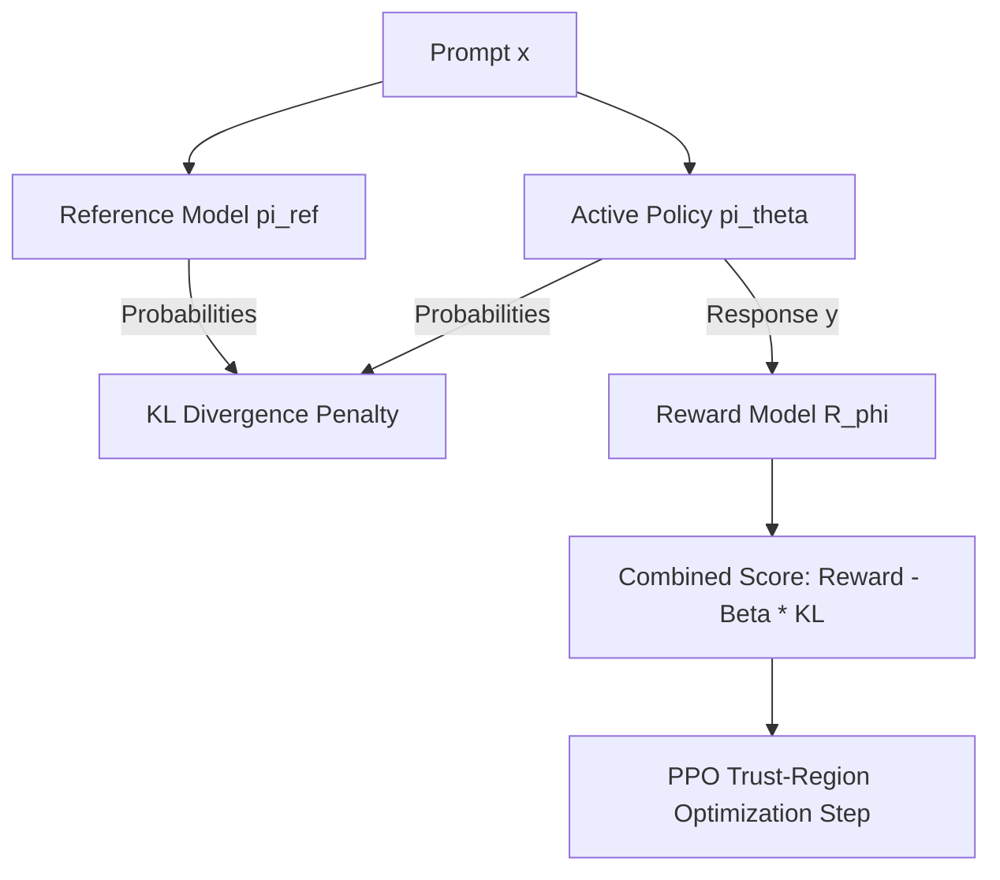

# RLHF Alignment for Frontier Reasoning Models

Large Language Models (LLMs) are aligned to human preferences using Reinforcement Learning from Human Feedback (RLHF). The trust-region clipped objective (PPO) is critical to prevent the language model from drifting into gibberish or cheating the reward model (reward hacking).

## Optimization Objective

The aligned language model optimizer solves:
$$\text{obj}(\theta) = \mathbb{E}_{(x, y) \sim D} \left[ R_\phi(x, y) - \beta D_{KL}(\pi_\theta(y|x) \parallel \pi_{ref}(y|x)) \right]$$

Where:
* $R_\phi(x, y)$ is the reward model score.
* $\pi_{ref}$ is the frozen supervised fine-tuned (SFT) model.
* The KL divergence acts as a distribution-space trust region, preventing the active model $\pi_\theta$ from deviating too far from the reference model.

## RLHF Pipeline

[Back to README](../README.md)
