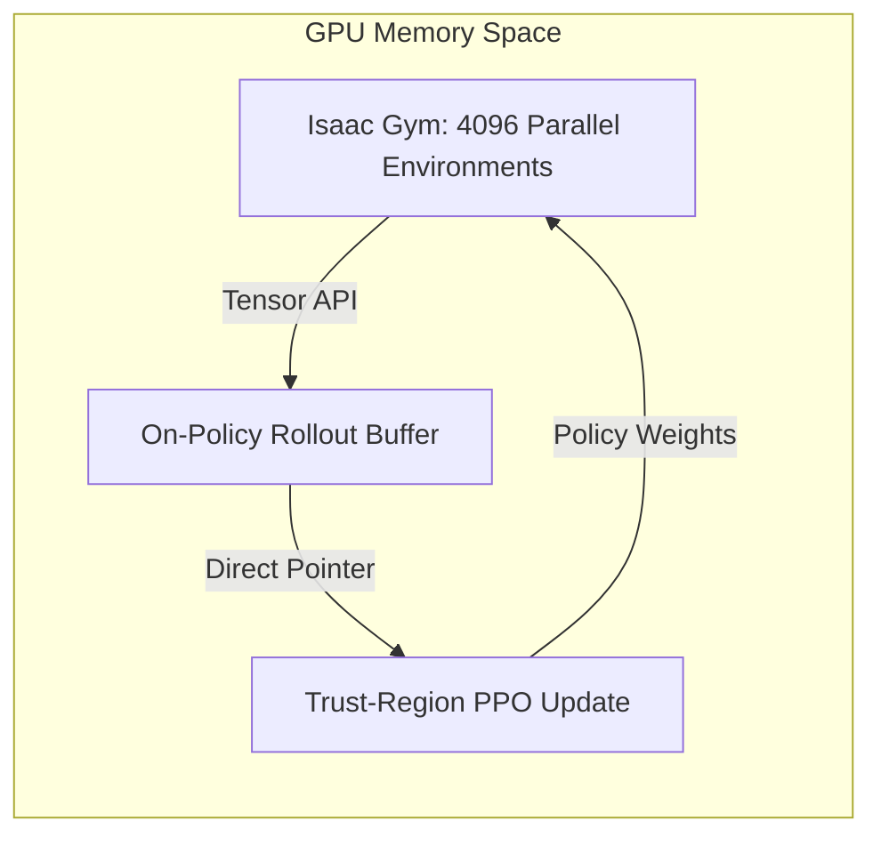

# The Sample Complexity / Latency Trade-Off

Trust-region estimation is highly sensitive to statistical noise. Accurate gradient and curvature calculations require massive amounts of on-policy environment interactions, creating high sample complexity and latency bottlenecks.

## The Challenge

To estimate the expectations under the current policy trajectory:
$$\hat{\mathbb{E}}_t \left[ \dots \right]$$

A small batch size leads to high variance, causing inaccurate step directions and potential policy degradation. However, collecting large on-policy batches from real environments (e.g. physical robots) introduces severe execution delays.

## Distributed Simulators (NVIDIA Isaac Gym)
To mitigate this, training is scaled across thousands of parallel environments running on GPU accelerators. Observations are transferred directly within GPU memory, avoiding CPU-GPU bottlenecks.

[Back to README](../README.md)
