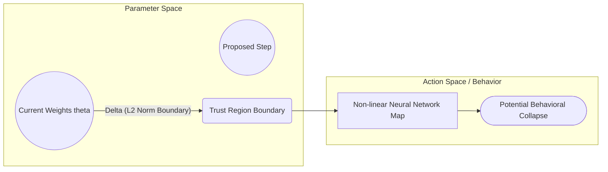

# Weight-Space Trust Regions

Weight-space trust regions constrain updates directly on the parameters (weights) of the model: $\|\Delta \theta\|_2 \le \Delta$. This approach represents the direct application of classical trust-region optimization to neural networks.

## Mathematical Formulation

The optimization step $\Delta \theta$ is obtained by solving:
$$\min_{\Delta \theta} L(\theta) + \nabla L(\theta)^T \Delta \theta + \frac{1}{2} \Delta \theta^T H \Delta \theta \quad \text{s.t.} \quad \|\Delta \theta\|_2 \le \Delta$$

In deep learning:
* **Pros:** Easy to compute geometrically.
* **Cons:** Extremely fragile because neural network parameter space is highly non-linear. A small change in a single critical weight can completely destroy the policy behavior, while large changes in other weights might have zero effect (the parameter-to-behavior mapping is not isometric).

## Geometric Intuition

[Back to README](../README.md)
